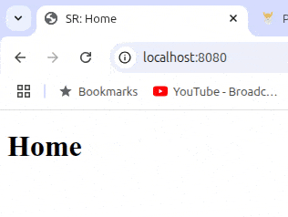

# Basic information site with Express

follow-up from Node.js is to use it in conjunction with Express. This will handle many processes, making GET requests easier.

## Model



## Project Highlights:

- Using `app.get()` to handle the user's GET requests.
- `res.sendFile` is used to send files as a response and display them on the DOM.
- Handling errors with `app.use` to display the `404.html` page when the request does not match any defined routes.
- Storing the PORT in the `.env` file and using `.gitignore` to protect sensitive information.
- Using `--watch` and adding it to the `package.json` as `npm run dev` to re-run the server when the file is changed.

## Challenges Overcome:

- Correctly importing and setting up Express.
- Understanding Express routes and how to respond to requests.
- Sending back the correct files for each request.
- Handling 404 errors when the request is invalid.

## New Skills Acquired:

- Using Express and adding routes.
- Using a `.env` file and importing it correctly.
- Setting up custom scripts and running them.
- Updating code to use a new framework.
- Error handling.

## Technologies Used:

- HTML
- Node.js
- JavaScript
- Express

## How to Clone

To clone this project to your local machine, follow these steps:

1. Open your terminal and navigate to the directory where you want to clone the project.
2. Run the following command:

   ```bash
   git clone https://github.com/SReddy-96/TOP-basic-information-site-with-express.git
   ```

3. Navigate into the project directory.
   ```bash
   cd TOP-node-basic-site
   ```
4. Install any dependencies (if applicable) and start the server:
   ```bash
   node index.js
   ```
5. Open your browser and navigate to http://localhost:8080 (or the port specified in your server file).
